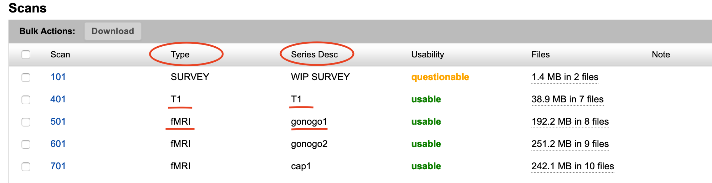

# BIDSMapping: Walkthrough Tutorial

## Introduction

This is a tutorial for using BIDSMapping tool, a DAX command line tool (https://github.com/VUIIS/dax). The BIDSMapping tool allows the user to create, update or replace rules/mapping at the project level on XNAT. For using BIDSMapping tool you require

- The lastest verion of DAX installed. Please check https://dax.readthedocs.io/en/latest/installing_dax_in_a_virtual_environment.html to install DAX in a virtual environment.
- A project on XNAT with imaging data.
- A dcm2niix module turned on for the project. Preferred if the dcm2niix_bids module is turned on for the project. The dcm2niix_bids will add the required json sidecar. However, the BIDSMapping tool is capable of adding the json sidecar when missing.

## Step 1: Mapping Datatype and Scans

You need to create a mapping for BIDS datatype and scans on XNAT. First, create the CSV file of the mapping that you would like to upload to XNAT.

Open a CSV file
```
(dax) $ vim (or nano or any editor you like) datatype.csv
```
Type the series_description and datatype you want to map
```
series_description,datatype
T1,anat
gonogo1,func
gonogo2,func
cap1,func
cap2,func
mid1,func
mid2,func
mid3,func
```
Please note, instead of scan_type in column 1 header series_description can also be used. Make sure the scan_type or series_description is from the scan on XNAT. Image below shows where the information can be found on XNAT.



Datatype column correspond to the BIDS datatype folder (https://bids.neuroimaging.io/) for the scan to be in. BIDS datatype folder is either:

– anat (structural imaging such as T1,T2,etc.)

– func (task based and resting state functional MRI)

– fmap (field inhomogeneity mapping data such as fieldmaps)

– dwi (diffusion weighted imaging). 

For more information checkout page 4 and 8 in https://www.biorxiv.org/content/biorxiv/suppl/2016/05/12/034561.DC4/034561-1.pdf

## Step 2: Upload Datatype Mapping to XNAT

## Step 3: Check Project Level File Manager

## Step 4: Mapping Tasktype and Scans

## Step 5: Upload Tasktype Mapping to XNAT

## Step 6: Mapping Repetition Time and Scans

## Step 7: Upload Repetition Time Mapping to XNAT

## Step 8: Check Project Level File Manager

## Additional Useful BIDSMapping Tool Options

### Step 1: Correct Old Mapping

### Step 2: Replace Existing Mapping

### Step 3: Check Corrected LOGFILE

### Step 4: Add New Mapping

### Step 5: Update Existing Mapping

### Step 6: Check Updated LOGFILE
