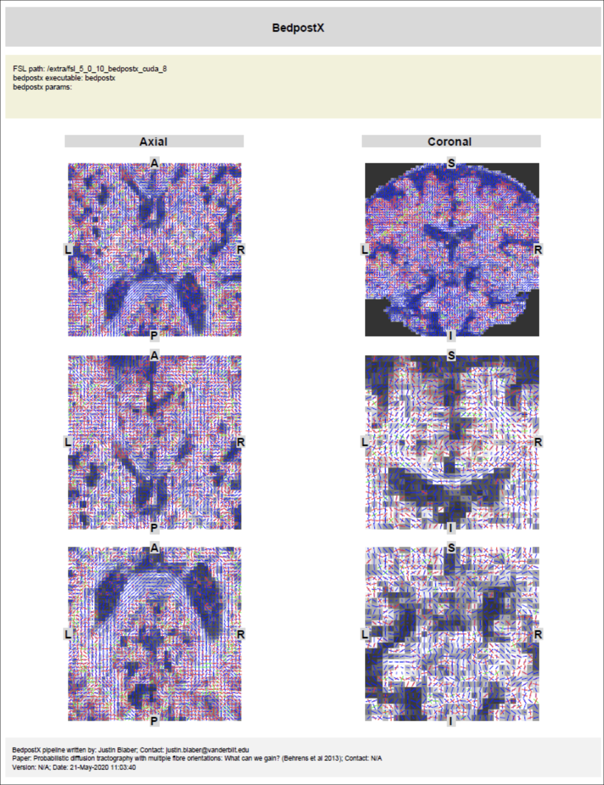

# bedpostx

- Current Version: bedpostx_v3.0.0
- Processor Name: bedpostx_v3.0.0_processor.yaml
- Container Location: [Docker](https://hub.docker.com/r/justinblaber/bedpostx/tags/)
- SHA256 Hash: bedpostx_v3.0.0.simg (SHA256 02baf50cafc8213790eac625a025f11e7ffc49aab51de4de5eff91d49fbe5260)

## Requirements/prerequisites

- dtiQA or preQual pipeline

## Examples

- [Diffusion Tensor Imaging (DTI) Mixed FSP](pdfs/bedpostx.pdf) 
