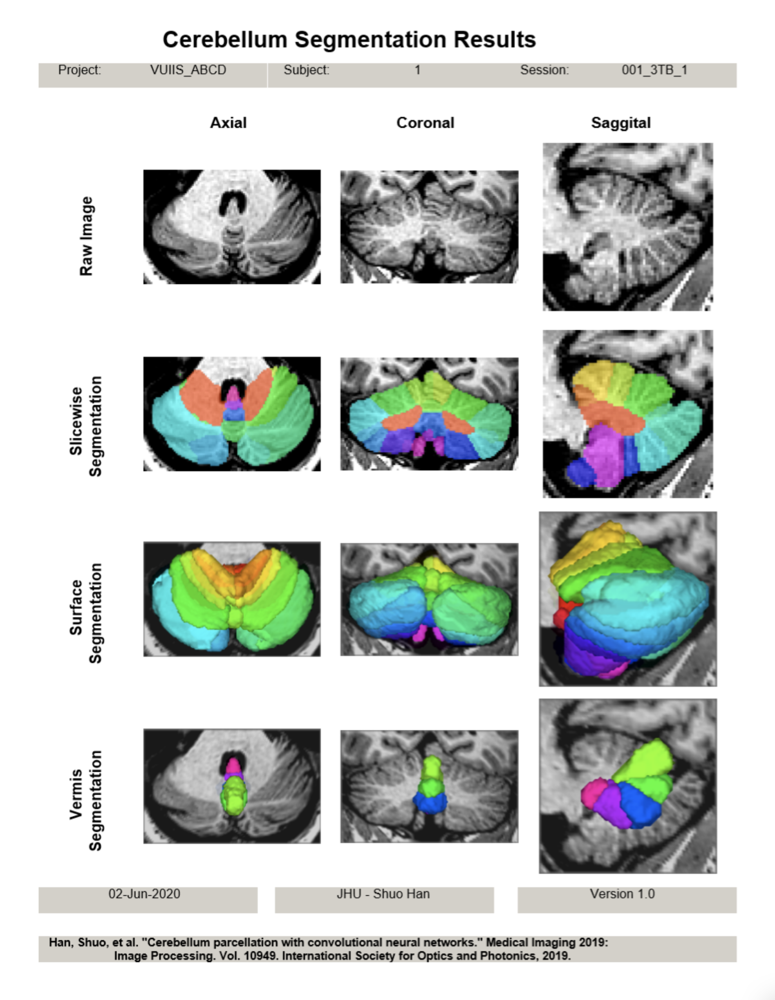
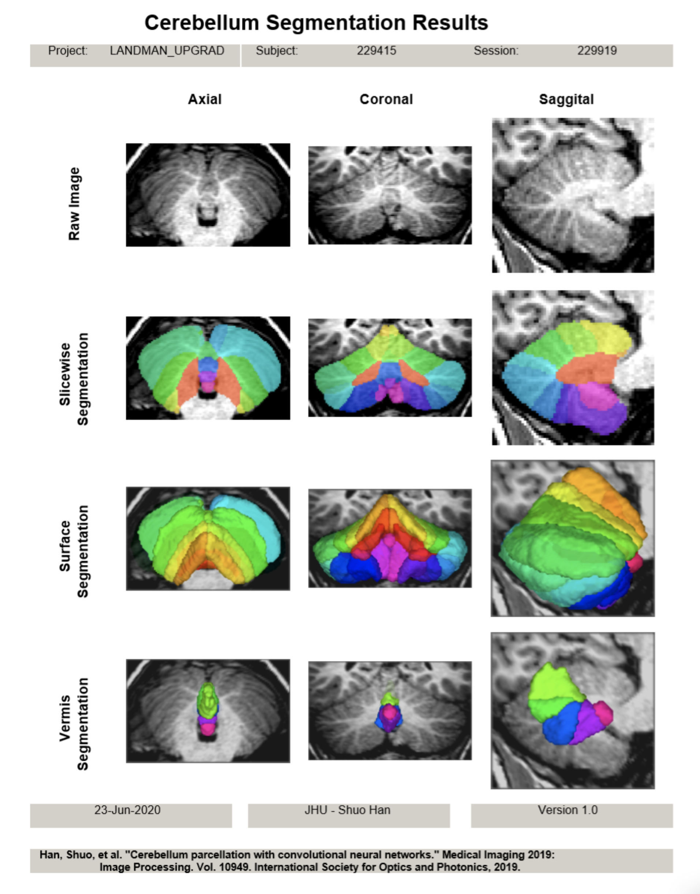
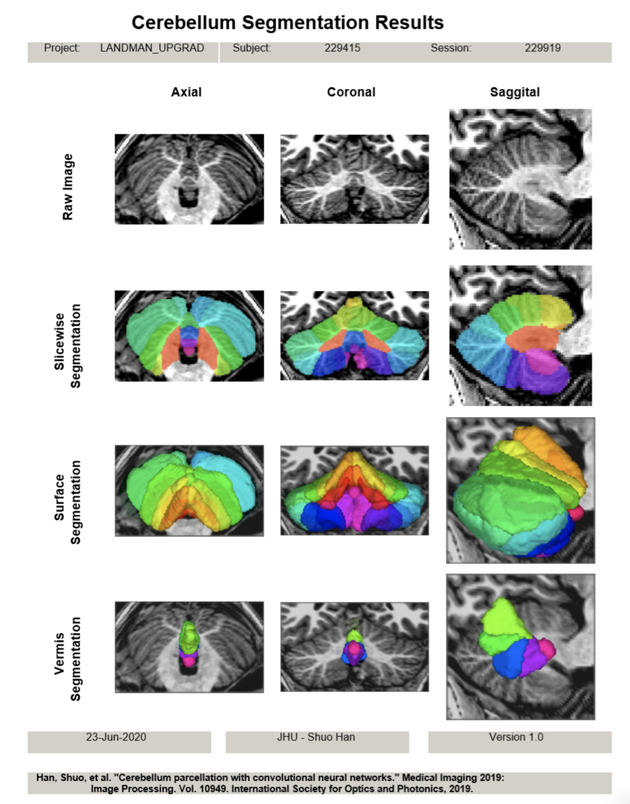

# cerebellum

## Cerebellum Parcelation

This singularity image does:
1. N4 bias field correction – [ROBEX](https://www.nitrc.org/projects/robex) is used to estimate a brain mask. This mask is then smoothed to generate a brain weight image. N4 from [ANTs](http://stnava.github.io/ANTs/) is used to perform the bias field correction with the weight image calculated above. For the use of a weighted image in N4, check the [document online](https://itk.org/Doxygen/html/classitk_1_1N4BiasFieldCorrectionImageFilter.html).
2. MNI registration – The images are rigidly registered to the [ICBM 2009c](http://www.bic.mni.mcgill.ca/ServicesAtlases/ICBM152NLin2009) nonlinear symmetric template using the ANTs package. The container supports longitudinal registration via calling `perform_mni.sh` (check `singularity exec SIMG_PATH perform_mni.sh -h` for more information), i.e. the first MPRAGE image from the longitudinal series of a subject is registered to this template and other images with different contrasts/from the following sessions are registered to the first MPRAGE image. However, since the `singularity run SIMG_PATH` only supports single input image, the longitudinal registration is not used by `singularity run`.
3. Cerebellum parcellation – The cerebellum of an MNI-registered MPRAGE image is parcellated using the method described in “Shuo Han, et al., Cerebellum parcellation with convolutional neural networks, SPIE 2019”. Note that this container does not use a network to locate the cerebellum in contrast to the paper above. Instead, it uses a cerebellum mask calculated from averaging the cerebellum masks of the training images registered into MNI space. Removing the neck should improve the results (the neck is scanned in the manual delineation images), such as using `robustfov` from fsl, but it is not done in this singularity container. The post processing is based on largest connected components which is also describe in the paper.
4. Report generation – Axial, coronal, and sagittal slices of the image and parcellation will be generated and concatenated as a large `.png` file. The singularity image contains environment varialbes `$ALPHA` to control the alpha channel of the parcellation overlay and `$NUM_SLICES` to control the number of slices shown in the pictures.

## Installation

Install [singularity 2.6](https://docs.sylabs.io/guides/2.6/user-guide/installation.html) using root.

## Usage

**NOTE:**
- The container only supports `.nii.gz` files right now
- It might not work if the image path contains extra `.nii` before the image file extension.

**bash**
- Suppose the singularity image is ~/parc.simg

`singularity run ~/parc.simg -i sample_image.nii.gz -o sample_output_directory`
- print help

`singularity run ~/parc.simg -h`

## Outputs

Suppose the output_directory is `output_dir`, the input image is `image.nii.gz`
- The MNI aligned image is `output_dir/mni/image_n4_mni.nii.gz`
- The parcellation is `output_dir/parc/image_n4_mni_seg.nii.gz`
- The post-processed parcellation is `output_dir/parc/image_n4_mni_seg_post.nii.gz`
- The parcellation in the original space is `output_dir/parc/image_n4_mni_seg_post_inverse.nii.gz`
- The report is in `output_dir/pics`. `output_dir/pics/intermidiate` has the axial, coronal, and sagittal slices of (from left to right in the picture) the `image_n4_mni.nii.gz` image, the `image_n4_mni_seg.nii.gz` overlay, and the `image_n4_mni_seg_post.nii.gz` overlay. `output_dir/pics/final` has the parcellation in the original image space. From left to right, `image.nii.gz` and `image_n4_mni_seg_post_inverse.nii.gz`. `output_dir/.png` has the individual slices of all the images.

**NOTE:**
In case post processing fails and the network output `*_seg.nii.gz` is preferred, check the last few lines of `singularity exec parc.simg cat /singularity` for applying the inverse transformation to bring the parcellation back to the original space.

## Known Issues
1. The parcellation does not support GPU, but the processing is still fast.
2. Use `export SINGULARITY_HOME=$PWD` (`$PWD` is the current folder) if the image is not in the `$HOME` directory (make sure the image is in the current folder or the container will not able to find the image).
3. Or one can mount the directory into the container such as `singularity run -B $PWD:/mnt $SING_PATH -i /mnt/sample_image.nii.gz -o /mnt/sample_output_folder`. I normally mount the root directory `/` so the container is able to find all files.
4. The path to the image and the output folder are relative to the container. If the directory name is omitted for an image, it means it is relative to the home directory of the container which is normally the home directory of your file system since `singularity` automatically mounts the home directory correctly.

## Version Information
- Current Version: cerebellum_v1.0.0
- Processor Name: cerebellum_v1.0.0_processor.yaml
- SHA256 Hash: cerebellum_v1.0.0.simg (SHA256 caf99fa955198735f3feb506a2d9a47862326dd04b18b2dcd4438ef42840062e)

## Examples
**VUIIS_ABCD**
- [cerebellum](pdfs/cerebellum.pdf)

**LANDMAN_UPGRAD**
- A: [cerebellum](pdfs/cerebellum_T1W.pdf)

- B: [cerebellum](pdfs/cerebellum_T1.pdf)

## References
