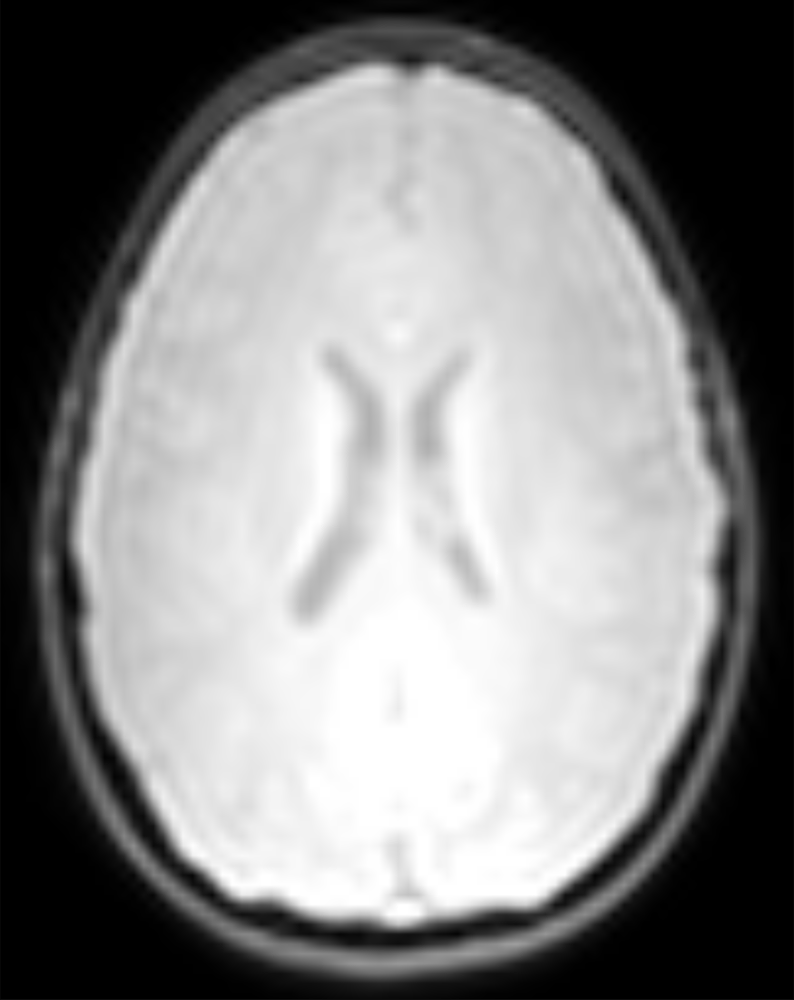

# Demonstration Area

The demonstration area is a place to demonstrate what some of our processing pipelines or spiders, can do with both adult and adolescent/child neuroimaging data with processing examples. All scans were taken via a Phillips 3T MRI system.

From the FAQ page:

[What is a Spider?](faq.md#what-is-a-spider)

## Example Project: VUIIS_ABCD

VUIIS-available scan protocols modeled after [The Adolescent Brain Cognitive Development (ABCD) study](https://www.ncbi.nlm.nih.gov/pmc/articles/PMC5999559/)

| IMAGE | SUMMARY |
| ----- | ------- |
|  | **T1-weighted**     Matrix = 256×240   Slices = 225   FOV(mm)= 256x240x225   Voxel Size(mm) = 1x1x1   TR = 6.3ms, TE = 2.9ms   Flip Angle = 8   Scan Mode = 3D FFE, TFE Factor = 150   Duration = 5 min 37 sec     **Spiders:**   [BISCUIT](BISCUIT-curve_extract-surf.md), [BrainAgeGap](brainagegap.md), [cat12](cat12_ss2p0.md), [cerebellum](cerebellum.md), [cersuit](cersuit.md), [curve_extract](BISCUIT-curve_extract-surf.md), [FMRIQA](fmriqa.md), [freesurfer](freesurfer.md), [FS6](fs6.md), [MaCRUISE](macruise.md), [magm_normalize](magm_normalize.md), [Multi_Atlas](multi_atlas.md), [nobis_tract](nobis_tracts.md), [RecoBundles](recobundles.md), [reface](reface.md), [RSFC_CONN](rsfc_conn.md), [slant](slant.md), [surf_\*](BISCUIT-curve_extract-surf.md), [Temporal_Lobe](temporal_lobe.md), [tracula](tracula.md) |
|  | **T2**     Matrix = 256×256   Slices = 256   FOV (mm) = 256x256x256   Voxel Size (mm) = 1x1x1   TR = 2500 ms, TE = 251.6 ms   Flip Angle = 90   Scan Mode = 3D SE, TSE Factor = 120   Duration = 2 min 52 sec |
|  | **Diffusion Tensor Imaging (DTI) Mixed FSP**     Matrix = 128×129   Slices = 75   FOV (mm) = 220x220x140   Voxel Size (mm) = 1.7×1.7   TR = 5855 ms, TE = 101.9 ms   Flip Angle = 78   Scan Mode = MS SE   Duration = 10 min 47 sec   SENSE P reduction (AP) = 1   MB Factor = 3     **Spiders:**   [bedpostx](bedpostx.md), [dtiQA](dtiqa-prequal.md) |
|  | **Diffusion Tensor Imaging (DTI) FSA**     Matrix = 128×129   Slices = 75   FOV (mm) = 220x220x140   Voxel Size (mm) = 1.7×1.7   TR = 3736 ms, TE = 67.2 ms   Flip Angle = 78   Scan Mode = MS SE   Duration = 33 sec   SENSE P reduction (AP) = 1   MB Factor = 3     **Spiders:**   [dtiQA](dtiqa-prequal.md) |
|  | **Functional MRI (fMRI) FSP**     Matrix = 92×89   Slices = 60   FOV (mm) = 216x216x144   Voxel Size (mm) = 2.4×2.4   TR = 841.6 ms, TE = 30 ms   Flip Angle = 52   Scan Mode = MS FFE   Duration = 5 min 43 sec   SENSE P reduction (AP) = 1   MB Factor = 6     Spiders:   [connprep](connprep.md), [FMRIQA](fmriqa.md), [RSFC_CONN](rsfc_conn.md) |
|  | **Functional MRI (fMRI) FSA**     Matrix = 92×89   Slices = 60   FOV (mm) = 216x216x144   Voxel Size (mm) = 2.4×2.4   TR = 841 ms, TE = 30 ms   Flip Angle = 52   Scan Mode = MS FFE   Duration = 21 sec   SENSE P reduction (AP) = 1   MB Factor = 6     Spiders:   [FMRIQA](fmriqa.md), [RSFC_CONN](rsfc_conn.md) |

## Example Project: LANDMAN_UPGRAD

| IMAGE | SUMMARY |
| ----- | ------- |
|  | **T1-weighted**     Acquisition Matrix = 256×256   Slices = 170   FOV (mm) = 170x256x256   Voxel Size (mm) = 1x1x1   TE = 4.6 ms   Flip Angle = 8   Scan Mode = 3D T1TFE   Duration = 4 min 26 sec     **Spiders:**   [BISCUIT](BISCUIT-curve_extract-surf.md), [cat12](cat12_ss2p0.md), [cerebellum](cerebellum.md), [cersuit](cersuit.md), [dtiQA](dtiqa-prequal.md), [FMRIQA](fmriqa.md), [freesurfer](freesurfer.md), [FS6](fs6.md), [LST](lst.md), [Multi_Atlas](multi_atlas.md), [nobis_tract](nobis_tracts.md), [reface](reface.md), [RSFC_CONN](rsfc_conn.md), [tracula](tracula.md) |
|  | **T1**     Acquisition Matrix = 256×256   Slices = 170   FOV (mm) = 170x256x256   Voxel Size (mm) = 1x1x1   TE = 3.7 ms   Flip Angle = 5   Scan Mode = 3D T1TFE   Duration = 6 min 26 sec   **Spiders:**   [BISCUIT](BISCUIT-curve_extract-surf.md), [cat12](cat12_ss2p0.md), [cerebellum](cerebellum.md), [cersuit](cersuit.md), [FMRIQA](fmriqa.md), freesurfer](freesurfer.md), [FS6](fs6.md), [LST](lst.md), [Multi_Atlas](multi_atlas.md), [nobis_tract](nobis_tracts.md), [RSFC_CONN](rsfc_conn.md), [tracula](tracula.md) |
|  | **T2-weighted**     Acquisition Matrix = 460×450   Slices = 26   FOV (mm) = 480×480   Voxel Size (mm) = 0.479×0.479   TE = 90 ms   Flip Angle = 90   Scan Mode = 2D TSE   Duration = 3 min 52 sec |
|  | **FLAIR**     Acquisition Matrix = 232×187   Slices = 75   FOV (mm) 320×320   Voxel Size (mm) = 0.719×0.719   TE = 1.2e2 ms   Flip Angle = 90   Scan Mode = 2D TIR   Duration = 7 min 30 sec   **Spiders:**   [LST](lst.md) |
|  | **DTI**     Acquisition Matrix = 96×94   Slices = 1700   FOV (mm) = 96×96   Voxel Size (mm) = 2.5×2.5   TE = 53 ms   Flip Angle = 90   Scan Mode = 2D DwiSE   Duration = 5 min 3 sec   SENSE P reduction (AP) = 1   MB Factor = 2.2   **Spiders:**   [nobis_tract](nobis_tracts.md), [tracula](tracula.md) |
|  | **DTI_APA**     Acquisition Matrix = 96×94   Slices = 400   FOV (mm) = 96×96   Voxel Size (mm) = 2.5×2.5   TE = 53 ms   Flip Angle = 90   Scan Mode = 2D DwiSE   Duration = 1 min 41 sec   SENSE P reduction (AP) = 1   MB Factor = 2.2   Spiders:   [dtiQA](dtiqa-prequal.md), [nobis_tract](nobis_tracts.md), [tracula](tracula.md) |
|  | **HARDI**     Acquisition Matrix = 96×94   Slices = 3050   FOV (mm) = 96×96   Voxel Size (mm) = 2.5×2.5   TE = 75 ms   Flip Angle = 90   Scan Mode = 2D DwiSE   Duration = 7 min 17 sec   **Spiders:**   [dtiQA](dtiqa-prequal.md), [nobis_tract](nobis_tracts.md), [tracula](tracula.md) |
|  | **DTI2**     Acquisition Matrix = 96×94   Slices = 1700   FOV (mm) = 96×96   Voxel Size (mm) = 2.5×2.5   TE = 75 ms   Flip Angle = 90   Scan Mode = 2D DwiSE   Duration = 4 min 6 sec   SENSE P reduction (AP) = 1   MB Factor = 2.2   **Spiders: **  [nobis_tract](nobis_tracts.md), [tracula](tracula.md) |
|  | **B0map**     Acquisition Matrix = 80×80   Slices = 100   FOV (mm) = 128×128   Voxel Size (mm) = 1.875×1.875   TE = 3.3 ms   Flip Angle = 30   Scan Mode = 2D FFE   Duration = 57 sec |
|  | **fMRI_Rest**     Acquisition Matrix = 80×78   Slices = 7714   FOV (mm) = 80×80   Voxel Size (mm) = 3×3   TE = 28 ms   Flip Angle = 90   Scan Mode = 2D FEEPI   Duration = 7 min   SENSE P reduction (AP) = 1   MB Factor = 2   **Spiders:**   [connprep](connprep.md), [RSFC_CONN](rsfc_conn.md) |
