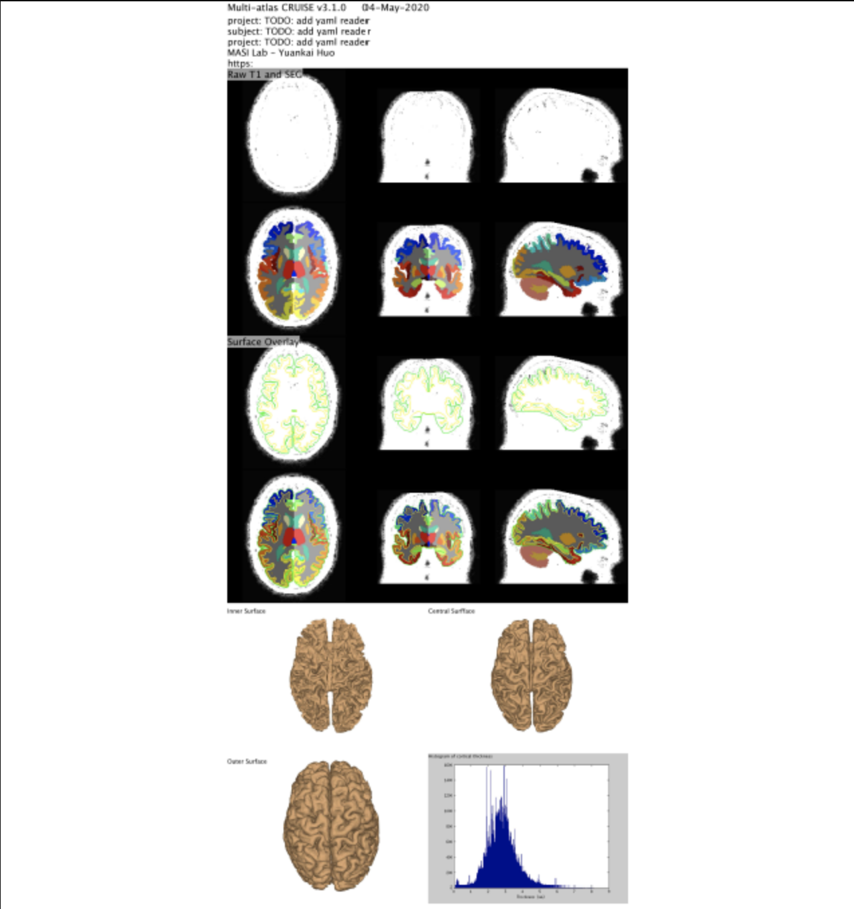

# MaCRUISE

## Requirements/Prerequisites

- Multi_Atlas pipeline

## Version Information

- Current Version: macruise_multiatlas_v3.2.0
- Processor Name: macruise_multiatlas_v3.2.0_processor.yaml
- SHA256 Hash: macruise_classern_v3.2.0.simg (SHA256 1c6cfba6b6e8d9e964fe349d3b454d831159e336aabe00ca9df5cd81d652a832)

## Examples

- [macruise_v3](pdfs/MaCRUISEspider.pdf) 

## Code

- [GitHub Repo for Current Spider](https://github.com/MASILab/MaCRUISE)

## References

- [Yuankai Huo, Andrew J. Plassard, Aaron Carass, Susan M. Resnick, Dzung L. Pham, Jerry L. Prince, and Bennett A. Landman. “Consistent cortical reconstruction and multi-atlas brain segmentation.” NeuroImage 138 (2016): 197-210.](https://pubmed.ncbi.nlm.nih.gov/27184203/)
Whole brain segmentation and cortical surface reconstruction are two essential techniques for investigating the human brain. Spatial inconsistences, which can hinder further integrated analyses of brain structure, can result due to these two tasks typically being conducted independently of each other. FreeSurfer obtains self-consistent whole brain segmentations and cortical surfaces. It starts with subcortical segmentation, then carries out cortical surface reconstruction, and ends with cortical segmentation and labeling. However, this “segmentation to surface to parcellation” strategy has shown limitations in various cohorts such as older populations with large ventricles. In this work, we propose a novel “multi-atlas segmentation to surface” method called Multi-atlas CRUISE (MaCRUISE), which achieves self-consistent whole brain segmentations and cortical surfaces by combining multi-atlas segmentation with the cortical reconstruction method CRUISE. A modification called MaCRUISE(+) is designed to perform well when white matter lesions are present. Comparing to the benchmarks CRUISE and FreeSurfer, the surface accuracy of MaCRUISE and MaCRUISE(+) is validated using two independent datasets with expertly placed cortical landmarks. A third independent dataset with expertly delineated volumetric labels is employed to compare segmentation performance. Finally, 200MR volumetric images from an older adult sample are used to assess the robustness of MaCRUISE and FreeSurfer. The advantages of MaCRUISE are: (1) MaCRUISE constructs self-consistent voxelwise segmentations and cortical surfaces, while MaCRUISE(+) is robust to white matter pathology. (2) MaCRUISE achieves more accurate whole brain segmentations than independently conducting the multi-atlas segmentation. (3) MaCRUISE is comparable in accuracy to FreeSurfer (when FreeSurfer does not exhibit global failures) while achieving greater robustness across an older adult population. MaCRUISE has been made freely available in open source.

- [Yuankai Huo, Aaron Carass, Susan M. Resnick, Dzung L. Pham, Jerry L. Prince, and Bennett A. Landman. “Combining multi-atlas segmentation with brain surface estimation.” In Medical Imaging 2016: Image Processing, vol. 9784, p. 97840E. International Society for Optics and Photonics, 2016.](https://www.ncbi.nlm.nih.gov/pmc/articles/PMC4845967/)
Whole brain segmentation (with comprehensive cortical and subcortical labels) and cortical surface reconstruction are two essential techniques for investigating the human brain. The two tasks are typically conducted independently, however, which leads to spatial inconsistencies and hinders further integrated cortical analyses. To obtain self-consistent whole brain segmentations and surfaces, FreeSurfer segregates the subcortical and cortical segmentations before and after the cortical surface reconstruction. However, this “segmentation to surface to parcellation” strategy has shown limitations in various situations. In this work, we propose a novel “multi-atlas segmentation to surface” method called Multi-atlas CRUISE (MaCRUISE), which achieves self-consistent whole brain segmentations and cortical surfaces by combining multi-atlas segmentation with the cortical reconstruction method CRUISE. To our knowledge, this is the first work that achieves the reliability of state-of-the-art multi-atlas segmentation and labeling methods together with accurate and consistent cortical surface reconstruction. Compared with previous methods, MaCRUISE has three features: (1) MaCRUISE obtains 132 cortical/subcortical labels simultaneously from a single multi-atlas segmentation before reconstructing volume consistent surfaces; (2) Fuzzy tissue memberships are combined with multi-atlas segmentations to address partial volume effects; (3) MaCRUISE reconstructs topologically consistent cortical surfaces by using the sulci locations from multi-atlas segmentation. Two data sets, one consisting of five subjects with expertly traced landmarks and the other consisting of 100 volumes from elderly subjects are used for validation. Compared with CRUISE, MaCRUISE achieves self-consistent whole brain segmentation and cortical reconstruction without compromising on surface accuracy. MaCRUISE is comparably accurate to FreeSurfer while achieving greater robustness across an elderly population.
