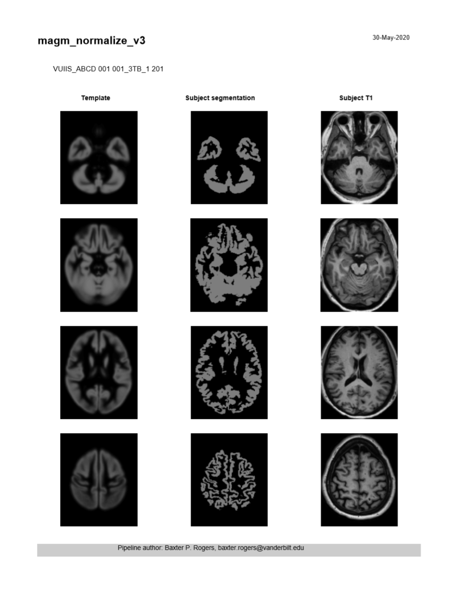
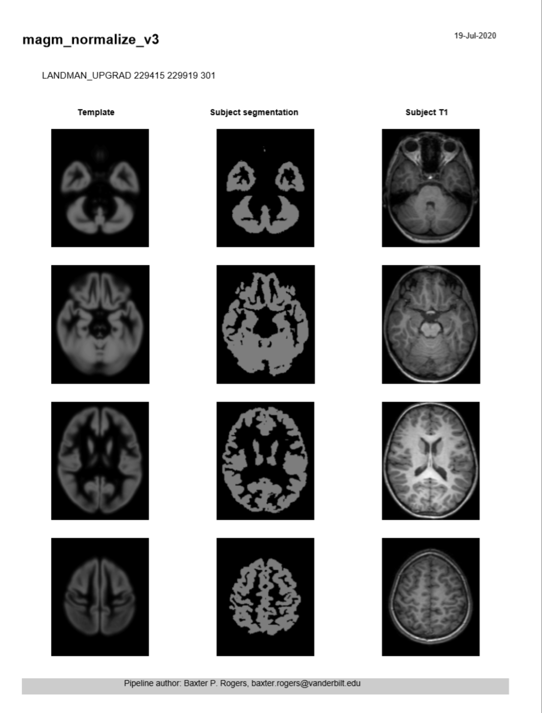
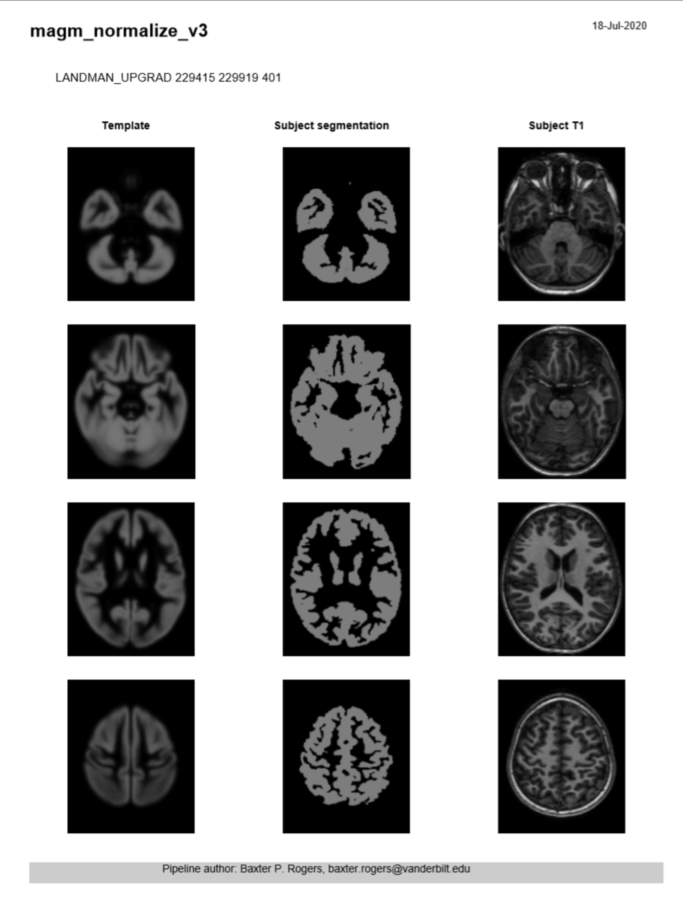

# magm_normalize

Computes a gray matter image from MultiAtlas output, and warps it to MNI space. It is a two-step process: first a rigid-body registration with SPM12 “Coreg” to initialize, then a nonlinear warp with SPM12 “Old Normalise”. Outputs are the two transforms; and the T1, gray matter, and MultiAtlas segmentation images after each transform is applied.

## Requirements/Prerequisites

- macruise_multiatlas pipeline

## Version Information

- Current Version: magm-normalize_v3.0.0
- Processor Name: magm-normalize_v3.0.0.yaml
- Singularity Recipe and Code: https://github.com/baxpr/magm-normalize
- Container Location: shub://baxpr/magm-normalize:v3.0.0
- SHA256 Hash: baxpr-magm-normalize-master-v3.0.0.simg (SHA256 af7abb5b4356b188d46412c1f49c79199700e4c656c8f37eda1bf544ad562f01)

## Examples

**VUIIS_ABCD**

- [magm_normalize_v3](pdfs/magm_normalize-1.pdf) 

**LANDMAN_UPGRAD**

- A: [Diffusion Tensor Imaging (DTI) Mixed FSP](pdfs/magm_normalize_v3_T1W_LU.pdf) 

- B: [Diffusion Tensor Imaging (DTI) Mixed FSP](pdfs/magm_normalize_v3_T1_LU.pdf) 

## Code

- [GitHub Repository for Current Spider](https://github.com/baxpr/magm-normalize)
