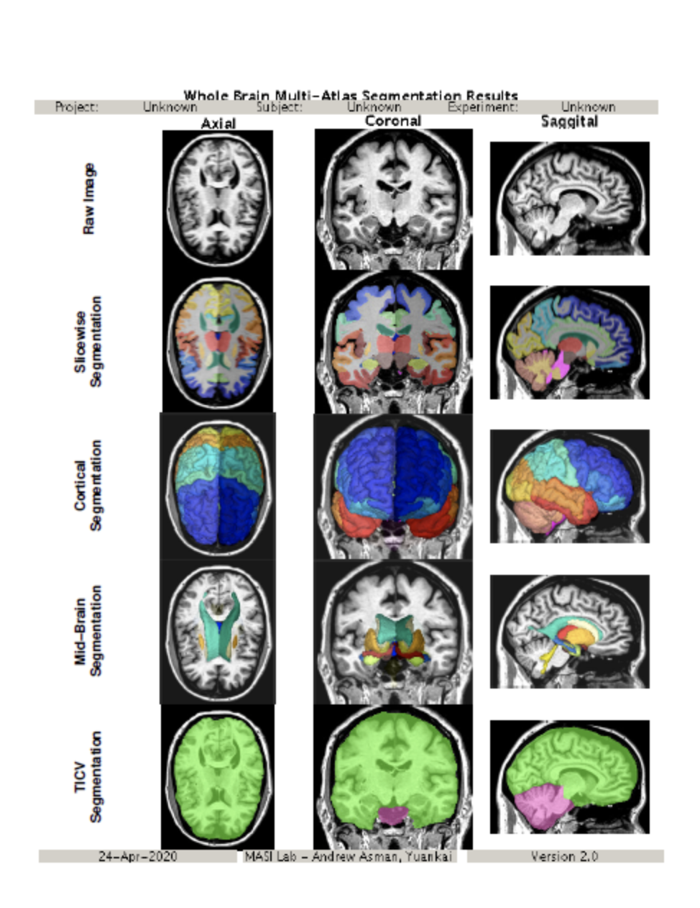
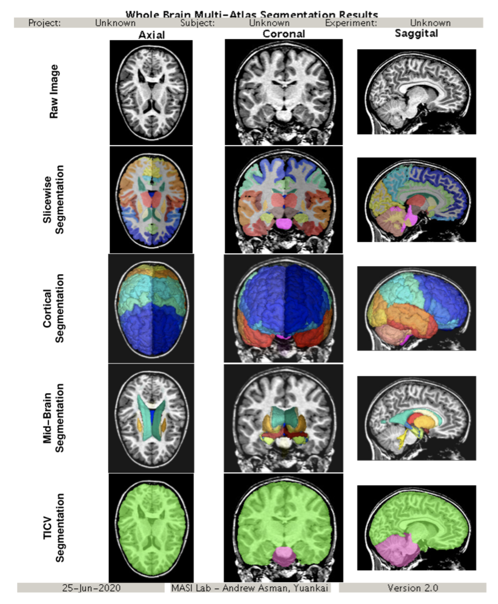
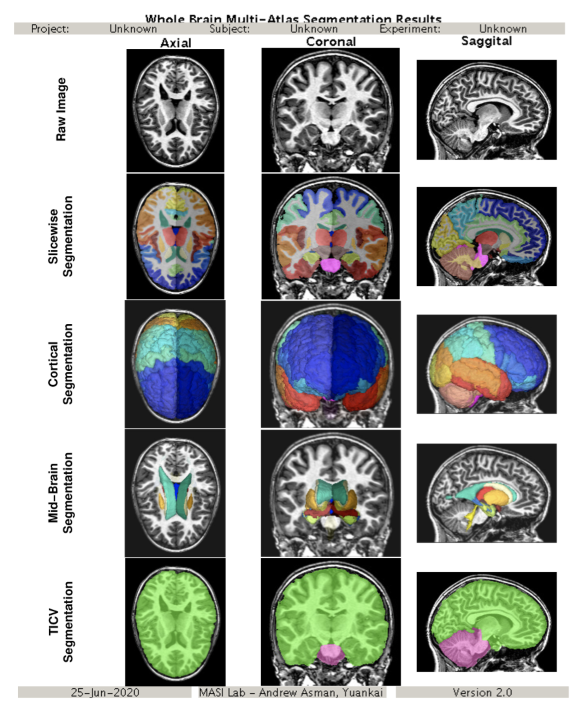

# Multi_Atlas

## Reference for Region Labels

The region labels can be found on the github page for the project: https://github.com/VUIIS/Multi-Atlas-v3.0.0/blob/master/atlas-label-info.csv

## Version Information

- Current Version: Multi_Atlas_v3.0.1
- Processor Name: Multi_Atlas_v3.0.1_processor.yaml
- Singularity Recipe and Code: https://github.com/VUIIS/Multi-Atlas-v3.0.0
- SHA256 Hash: Multi_Atlas_v3.0.0.simg (SHA256 da214d9a914930c78c91e11581666e2a2a1e87f4d48c71289556bcc2b025177f)

## Examples

**VUIIS_ABCD**

- [Multi_Atlas_v3](pdfs/Multi_Atlas_v3.pdf) 

**LANDMAN_UPGRAD**

- A: [Multi_Atlas_v3](pdfs/Multi_Atlas_v3_T1W.pdf) 

- B: [Multi_Atlas_v3](pdfs/Multi_Atlas_v3_T1.pdf) 

## Code

- [Multi_Atlas_v3](https://github.com/VUIIS/Multi-Atlas-v3.0.0)

## References

- [Asman, A.J. and Landman, B.A., 2014. Hierarchical performance estimation in the statistical label fusion framework. Medical image analysis, 18(7), pp.1070-1081.](https://www.sciencedirect.com/science/article/abs/pii/S1361841514000991)
Label fusion is a critical step in many image segmentation frameworks (e.g., multi-atlas segmentation) as it provides a mechanism for generalizing a collection of labeled examples into a single estimate of the underlying segmentation. In the multi-label case, typical label fusion algorithms treat all labels equally – fully neglecting the known, yet complex, anatomical relationships exhibited in the data. To address this problem, we propose a generalized statistical fusion framework using hierarchical models of rater performance. Building on the seminal work in statistical fusion, we reformulate the traditional rater performance model from a multi-tiered hierarchical perspective. The proposed approach provides a natural framework for leveraging known anatomical relationships and accurately modeling the types of errors that raters (or atlases) make within a hierarchically consistent formulation. Herein, the primary contributions of this manuscript are: (1) we provide a theoretical advancement to the statistical fusion framework that enables the simultaneous estimation of multiple (hierarchical) confusion matrices for each rater, (2) we highlight the amenability of the proposed hierarchical formulation to many of the state-of-the-art advancements to the statistical fusion framework, and (3) we demonstrate statistically significant improvement on both simulated and empirical data. Specifically, both theoretically and empirically, we show that the proposed hierarchical performance model provides substantial and significant accuracy benefits when applied to two disparate multi-atlas segmentation tasks: (1) 133 label whole-brain anatomy on structural MR, and (2) orbital anatomy on CT.

- [Huo, Y., Asman, A.J., Plassard, A.J. and Landman, B.A., 2017. Simultaneous total intracranial volume and posterior fossa volume estimation using multi‐atlas label fusion. Human brain mapping, 38(2), pp.599-616.](https://pubmed.ncbi.nlm.nih.gov/27726243/)
Total intracranial volume (TICV) is an essential covariate in brain volumetric analyses. The prevalent brain imaging software packages provide automatic TICV estimates. FreeSurfer and FSL estimate TICV using a scaling factor while SPM12 accumulates probabilities of brain tissues. None of the three provide explicit skull/CSF boundary (SCB) since it is challenging to distinguish these dark structures in a T1-weighted image. However, explicit SCB not only leads to a natural way of obtaining TICV (i.e., counting voxels inside the skull) but also allows sub-definition of TICV, for example, the posterior fossa volume (PFV). In this article, they proposed to use multi-atlas label fusion to obtain TICV and PFV simultaneously. The main contributions are: (1) TICV and PFV are simultaneously obtained with explicit SCB from a single T1-weighted image. (2) TICV and PFV labels are added to the widely used BrainCOLOR atlases. (3) Detailed mathematical derivation of non-local spatial STAPLE (NLSS) label fusion is presented. As the skull is clearly distinguished in CT images, we use a semi-manual procedure to obtain atlases with TICV and PFV labels using 20 subjects who both have a MR and CT scan. The proposed method provides simultaneous TICV and PFV estimation while achieving more accurate TICV estimation compared with FreeSurfer, FSL, SPM12, and the previously proposed STAPLE based approach. The newly developed TICV and PFV labels for the OASIS BrainCOLOR atlases provide acceptable performance, which enables simultaneous TICV and PFV estimation during whole brain segmentation. The NLSS method and the new atlases have been made freely available. Hum Brain Mapp 38:599-616, 2017.
